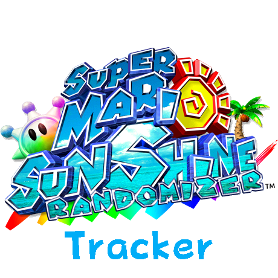
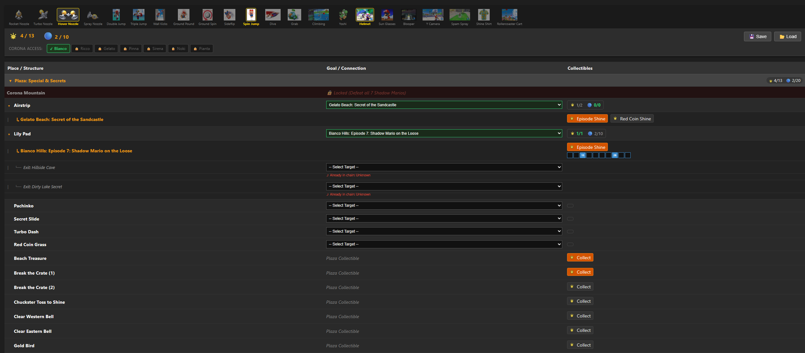

A tracker for the Super Mario Sunshine Randomizer that allows users to map randomized zones to Plaza entrances and track Shine and Blue Coin collections.


## License

* This code in this project is licensed under the MIT License. Assets in /static/images as well as other images and text from the game is not licensed at all and is owned by Nintendo. For more information, see [LICENSE](LICENSE) and [Asset Disclamer](https://github.com/CodeTappert/sms-tracker?tab=readme-ov-file#asset-disclaimer)
* If you are using the code or images from this project, please give appropriate credit to the original author (CodeTappert) and provide a link to the repository. This is not mandatory ofc but would be nice.

## Contributing

Contributions are welcome! Please open an issue or submit a pull request for any improvements or bug fixes.

## Features

* **Real-time Auto-Tracking**: Automatically syncs with Dolphin Emulator to detect your current level, episode, and movement/nozzle unlocks.
* **Zone Mapping**: Map randomized zones to Plaza entrances for easy navigation.
* **Shine Tracking**: Keep track of collected Shines and blue coins in each zone, plaza entrance, and overall.
* **Blue Coin Tracking**: Monitor blue coin collections per zone and overall with link to a detailed guide.
* **User-Friendly Interface**: Simple and intuitive interface for easy tracking.
* **Data Persistence**: Save and load your tracking data with JSON files.

## Screenshots


## Configuration
* By default, the tracker runs on port `8080`. To use a custom port, create a `config.json` file in the same directory as the executable:
* `trackerIntervalSeconds` controls how often (in seconds) the tracker checks Dolphin for updates.
* `autoTrackDefault` enables or disables auto-tracking by default on startup.
* `hostInNetwork` allows access from other devices in the same network when set to true. Defaults to false for localhost only.


```json
{
  "port": 8080,
  "trackerIntervalSeconds": 5,
  "autoTrackDefault": true,
  "hostInNetwork": false
}
```

## Download and Execution

### Precompiled Binaries

* You can download precompiled binaries from the releases section

### Running the Application

#### Linux
  * Due to security restrictions on reading process memory, you must give the binary permission to "peek" into Dolphin:
  1. Open a terminal in the directory where you downloaded the binary or want to run it from.
  2. Run the following command to give the binary the necessary permissions (once):
  ```bash
  sudo setcap cap_sys_ptrace+ep ./sms-tracker
  ``` 
  3. Now you can run the binary:
  ```bash
     ./sms-tracker
  ```
  Alternatively, you can run the binary with `sudo` (not recommended for security reasons):
  ```bash
     sudo ./sms-tracker
  ```
#### Windows
   ```bash
   sms-tracker.exe
   ```

### Accessing the Tracker
* Then open your web browser and navigate to `http://localhost:8080` (or your specified port) to access the tracker.
* You can also Ctrl+Click the link in the console to open it directly.
* The project runs fully offline. No internet connection is required!
* No data is send to any external host or server. Everything stays on YOUR machine

## Compilation

### Prerequisites

* **Go**: You need the Go programming language installed to compile or run the backend.

### Compiling Linux
To compile the application into a binary, use the following command:

```bash
GOOS=linux GOARCH=amd64 go build -o sms-tracker .
```

### Compiling Windows
To compile the application for Windows, use the following command:

```bash
GOOS=windows GOARCH=amd64 go build -o sms-tracker.exe .
```


## ASSET DISCLAIMER:

This project contains assets (images, icons, names) from "Super Mario Sunshine"
which are the intellectual property of Nintendo. These assets are used for
fan/tracking purposes only.

The MIT License applies ONLY to the source code (Go, HTML, CSS, JS)
created for this project. It does NOT grant any rights to the game assets
contained within the "static/images" folder or any other game-related media.
All rights to those assets remain with Nintendo.

I am not responsible for any content that are shown on sites that this project or the software links to.